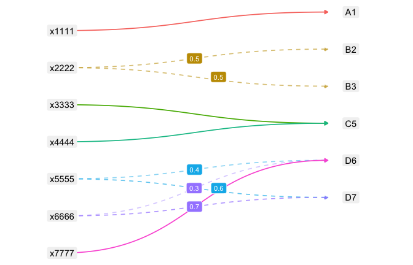
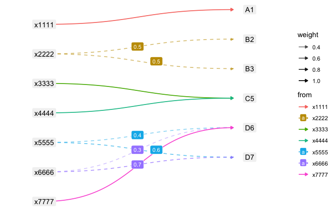
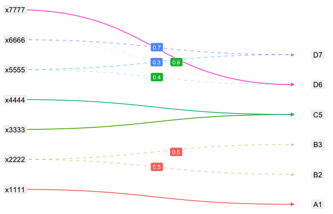
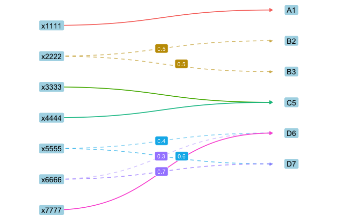
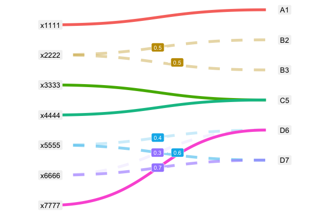

# Refactoring a multi-dataset ggplot2 chain


- [Before](#before)
- [After (a): layer-focused](#after-a-layer-focused)
  - [The removal-semantics footgun](#the-removal-semantics-footgun)
- [After (b): chart-focused](#after-b-chart-focused)
- [Equivalence](#equivalence)

A worked example for the `refactor-ggplot-helper` skill, covering the
case the ggtilecal example does not: a plot whose layers inherit
nothing. See [README.md](README.md) for the findings; this document
renders the plots.

Reproduce with `install.packages(c("xmap", "ggforce", "ggrepel"))`.

``` r
library(xmap)
library(dplyr)
library(ggplot2)

xm <- as_xmap_tbl(demo$simple_links, xcode, alphacode, weight)
xm
```

    # A crossmap tibble: 10 × 3
    # with unique keys:  [7] xcode -> [6] alphacode
       .from$xcode .to$alphacode .weight_by$weight
       <chr>       <chr>                     <dbl>
     1 x1111       A1                          1  
     2 x2222       B2                          0.5
     3 x2222       B3                          0.5
     4 x3333       C5                          1  
     5 x4444       C5                          1  
     6 x5555       D6                          0.4
     7 x5555       D7                          0.6
     8 x6666       D6                          0.3
     9 x6666       D7                          0.7
    10 x7777       D6                          1  

## Before

The original one-off chain. Note the **empty** `ggplot()`, the four
separate datasets, and the four `aes()` blocks each carrying its own
`data =`. Nothing inherits.

``` r
# BEFORE: a one-off multi-dataset ggplot2 chain
#
# A node-link (bipartite graph) view of an xmap crossmap: source codes in a
# left-hand column, target codes on the right, one arrow per link. Dashed
# arrows are fractional splits, labelled with their weight.
#
# Reproduce with:
#   install.packages(c("xmap", "ggforce", "ggrepel"))
library(xmap)
library(dplyr)
library(ggplot2)

xm <- as_xmap_tbl(demo$simple_links, xcode, alphacode, weight)

# ---- the code to refactor -------------------------------------------------
# Note what makes this different from `before-ggtilecal.R`:
#   * `ggplot()` is EMPTY -- there is no top-level data or mapping
#   * four separate datasets (edges, from_nodes, to_nodes, labels)
#   * four separate `aes()` blocks, each with its own `data =`
# Nothing inherits. See README.md for why that matters.

plot_xmap_bigraph <- function(.xmap) {
  edges <- tibble::tibble(
    from = .xmap$.from[[1]],
    to = .xmap$.to[[1]],
    weight = .xmap$.weight_by[[1]]
  )

  from_nodes <- distinct(edges, from) |> mutate(from_y = row_number())
  to_nodes <- distinct(edges, to) |> mutate(to_y = row_number() - 1 + 0.5)

  edges <- edges |>
    left_join(from_nodes, by = "from") |>
    left_join(to_nodes, by = "to") |>
    mutate(
      is_split = weight < 1,
      curve_linetype = ifelse(is_split, "dashed", "solid"),
      id = row_number()
    )

  labels <- edges |>
    filter(is_split) |>
    mutate(label_x = 0.5, label_y = (from_y + to_y) / 2)

  ggplot2::ggplot() +
    ggforce::geom_diagonal(
      data = edges,
      ggplot2::aes(
        # stop short of x = 1 so the arrowhead sits beside the .to label
        # rather than underneath it
        x = 0,
        y = from_y,
        xend = 0.92,
        yend = to_y,
        group = id,
        linetype = I(curve_linetype),
        alpha = weight,
        colour = from
      ),
      linewidth = 0.6,
      n = 100,
      arrow = grid::arrow(
        length = grid::unit(0.15, "cm"),
        type = "closed"
      )
    ) +
    ggplot2::geom_label(
      data = from_nodes,
      ggplot2::aes(x = 0, y = from_y, label = from),
      linewidth = 0,
      fill = "grey95"
    ) +
    ggplot2::geom_label(
      data = to_nodes,
      ggplot2::aes(x = 1, y = to_y, label = to),
      linewidth = 0,
      fill = "grey95"
    ) +
    ggrepel::geom_label_repel(
      data = labels,
      ggplot2::aes(x = label_x, y = label_y, label = weight, fill = from),
      size = 3,
      label.size = 0,
      colour = "white",
      seed = 1,
      direction = "x",
      max.overlaps = Inf,
      min.segment.length = 0
    ) +
    ggplot2::scale_colour_discrete(
      aesthetics = c("colour", "fill"),
      limits = unique(edges$from)
    ) +
    ggplot2::scale_y_reverse() +
    ggplot2::scale_alpha_continuous(range = c(0.4, 1)) +
    ggplot2::scale_x_continuous(limits = c(-0.15, 1.15)) +
    ggplot2::theme_void() +
    ggplot2::theme(legend.position = "none")
}

# ---- call site ------------------------------------------------------------
plot_xmap_bigraph(xm)
```

<div id="fig-before">



Figure 1: Before: a one-off multi-dataset ggplot2 chain

</div>

## After (a): layer-focused

Decision C → group list arguments by ggplot2 object type, the same shape
as `gg_facet_wrap_months()`.

``` r
# AFTER (a): layer-focused grouping -- .geom / .scale_coord / .theme
#
# Decision C took the layer-focused branch: list arguments grouped by ggplot2
# object type, the same shape as `after-gg_facet_wrap_months.R`.
#
# Reproduce with:
#   install.packages(c("xmap", "ggforce", "ggrepel"))
library(xmap)
library(dplyr)
library(ggplot2)

# NOTE ON THE DEFAULTS BELOW
# Because `ggplot()` is empty and each layer carries its own `data =`, the
# `.geom` defaults cannot be bare geoms -- there is nothing to inherit from.
# They reference `.layout`, which is bound in the function body BEFORE the
# `+` chain forces the lazily-evaluated defaults. Moving that binding below
# the `+` chain breaks the function with an unhelpful error.

#' Calculate Node-Link Layout for an Crossmap Bigraph
#'
#' Computes the plotting coordinates for a node-link (bipartite graph) diagram
#' of an `xmap_tbl`, without drawing anything. Source codes are placed in a
#' left-hand column and target codes in a right-hand column, each ordered by
#' first appearance, with the target column offset by half a row so the links
#' fan out visibly.
#'
#' Returns a named list of four tibbles:
#' - `edges`: one row per link, with `from`, `to`, `weight`, the joined
#'   `from_y`/`to_y` positions, `is_split` (a fractional weight), a
#'   `curve_linetype` of `"dashed"` for splits and `"solid"` otherwise, and an
#'   `id` used to group each curve.
#' - `from_nodes`: distinct source codes with their `from_y` positions.
#' - `to_nodes`: distinct target codes with their `to_y` positions.
#' - `labels`: the split links only, with `label_x`/`label_y` midpoints for
#'   annotating the weight.
#'
#' This is exported separately from [gg_diagonal_bigraph()] so the layout can be
#' inspected and tested without producing a plot, and so that users overriding
#' the `.geom` or `.scale_coord` arguments of [gg_diagonal_bigraph()] can obtain
#' the same data frames the defaults use.
#'
#' @param .xmap An `xmap_tbl`, as created by [as_xmap_tbl()].
#'
#' @return A named `list` of four tibbles: `edges`, `from_nodes`, `to_nodes`,
#'   `labels`.
#' @export (dropped: standalone script)
#'
#' @examples
#' xm <- as_xmap_tbl(demo$simple_links, xcode, alphacode, weight)
#' layout <- calc_bigraph_layout(xm)
#' layout$from_nodes
#' layout$edges
calc_bigraph_layout <- function(.xmap) {
  edges <- tibble::tibble(
    from = .xmap$.from[[1]],
    to = .xmap$.to[[1]],
    weight = .xmap$.weight_by[[1]]
  )

  from_nodes <- dplyr::mutate(
    dplyr::distinct(edges[, "from"]),
    from_y = dplyr::row_number()
  )
  to_nodes <- dplyr::mutate(
    dplyr::distinct(edges[, "to"]),
    to_y = dplyr::row_number() - 1 + 0.5
  )

  edges <- edges |>
    dplyr::left_join(from_nodes, by = "from") |>
    dplyr::left_join(to_nodes, by = "to") |>
    dplyr::mutate(
      is_split = .data[["weight"]] < 1,
      curve_linetype = ifelse(.data[["is_split"]], "dashed", "solid"),
      id = dplyr::row_number()
    )

  labels <- edges |>
    dplyr::filter(.data[["is_split"]]) |>
    dplyr::mutate(
      label_x = 0.5,
      label_y = (.data[["from_y"]] + .data[["to_y"]]) / 2
    )

  list(
    edges = edges,
    from_nodes = from_nodes,
    to_nodes = to_nodes,
    labels = labels
  )
}

#' Draw a Crossmap as a Node-Link Bigraph
#'
#' Draws the `.from -> .to` structure of an `xmap_tbl` as a bipartite node-link
#' diagram, with source codes on the left, target codes on the right, and a
#' curved arrow per link. Fractional weights are drawn as dashed, partly
#' transparent curves and annotated with a repelled label.
#'
#' The plot is built by:
#' - Computing node positions and link geometry via [calc_bigraph_layout()]
#' - Returning a ggplot object as per Details.
#'
#' @details
#' Returns a ggplot with the following **fixed** components, which use the
#' computed layout variables and therefore cannot be supplied by the caller
#' without first calling [calc_bigraph_layout()] themselves:
#' - each layer's `data` argument, taken from the list returned by
#'   [calc_bigraph_layout()]
#' - the `aes()` mappings, which reference the computed columns `from_y`,
#'   `to_y`, `label_x`, `label_y`, `id` and `curve_linetype`
#' - the horizontal geometry: source nodes at `x = 0`, target nodes at `x = 1`,
#'   and arrowheads stopping short at `xend = 0.92` so they sit beside the
#'   target label rather than underneath it
#'
#' and the following **default customisable** components:
#' - `ggforce::geom_diagonal()` to draw each link as a curve, with
#'   `linewidth = 0.6`, `n = 100` and a closed `grid::arrow()` of length
#'   `0.15cm`
#' - `ggplot2::geom_label()` twice, for the source and target node labels, each
#'   with `linewidth = 0` and `fill = "grey95"`
#' - `ggrepel::geom_label_repel()` to annotate fractional weights, with
#'   `size = 3`, `label.size = 0`, `colour = "white"`, `seed = 1`,
#'   `direction = "x"`, `max.overlaps = Inf` and `min.segment.length = 0`
#' - `ggplot2::scale_colour_discrete(aesthetics = c("colour", "fill"))` limited
#'   to the source codes, so link colour and weight-label fill agree
#' - `ggplot2::scale_y_reverse()` so the first source code appears at the top
#' - `ggplot2::scale_alpha_continuous(range = c(0.4, 1))` so lighter links mean
#'   smaller weights
#' - `ggplot2::scale_x_continuous(limits = c(-0.15, 1.15))` so the node label
#'   boxes are not clipped at the panel edge
#' - `ggplot2::theme_void()` and `ggplot2::theme(legend.position = "none")`
#'
#' To **modify** components, re-supply the whole of `.geom`, `.scale_coord` or
#' `.theme`. These layers do not use `inherit.aes`: the plot is built on an
#' empty `ggplot2::ggplot()` and each layer carries its own `data` and `aes()`.
#' A replacement `.geom` must therefore supply those too, which is what
#' [calc_bigraph_layout()] is exported for. The defaults are reproduced in full
#' in the argument list so they can be copy-pasted and edited.
#'
#' To **add** components, use the ggplot2 `+` function as normal, or pass
#' components to `.other`, which are added after the theme and so can override
#' it. This is the place for interactive geoms (e.g. from `ggiraph`).
#'
#' To **remove** any of the optional components, set the argument to an empty
#' `list()`.
#'
#' @section Removing `.scale_coord`:
#' Unlike `.geom` and `.theme`, emptying `.scale_coord` does not simply give a
#' plainer plot. It has three separate effects, one of them silent:
#' - dropping `scale_y_reverse()` flips the diagram vertically, so codes run
#'   bottom-to-top;
#' - dropping `scale_x_continuous(limits = ...)` clips the node label boxes at
#'   the panel edge;
#' - dropping `scale_colour_discrete(aesthetics = c("colour", "fill"),
#'   limits = ...)` de-synchronises the colour and fill palettes, so a link and
#'   its weight label may no longer share a colour. The plot still renders and
#'   still looks plausible; it just no longer means what it did.
#'
#' If you want to restyle only part of `.scale_coord`, copy the default list and
#' edit it rather than replacing it with a shorter one.
#'
#' @inheritParams calc_bigraph_layout
#' @param .geom,.scale_coord,.theme,.other
#'   Customisable lists of ggplot2 components to add to the plot. An empty
#'   `list()` leaves the plot unmodified, except for `.scale_coord` — see
#'   "Removing `.scale_coord`".
#'
#' @return A `ggplot` object.
#' @export (dropped: standalone script)
#'
#' @examplesIf rlang::is_installed(c("ggplot2", "ggforce", "ggrepel"))
#' xm <- as_xmap_tbl(demo$simple_links, xcode, alphacode, weight)
#'
#' gg_diagonal_bigraph(xm)
#'
#' # still composes with `+`
#' gg_diagonal_bigraph(xm) +
#'   ggplot2::theme(legend.position = "right")
#'
#' # drop the weight annotations and the node boxes, keeping only the links
#' layout <- calc_bigraph_layout(xm)
#' gg_diagonal_bigraph(
#'   xm,
#'   .geom = list(
#'     ggforce::geom_diagonal(
#'       data = layout$edges,
#'       ggplot2::aes(
#'         x = 0, y = from_y, xend = 1, yend = to_y,
#'         group = id, alpha = weight, colour = from
#'       )
#'     )
#'   )
#' )
gg_diagonal_bigraph <- function(
  .xmap,
  .geom = list(
    ggforce::geom_diagonal(
      data = .layout$edges,
      ggplot2::aes(
        x = 0,
        y = .data[["from_y"]],
        xend = 0.92,
        yend = .data[["to_y"]],
        group = .data[["id"]],
        linetype = I(.data[["curve_linetype"]]),
        alpha = .data[["weight"]],
        colour = .data[["from"]]
      ),
      linewidth = 0.6,
      n = 100,
      arrow = grid::arrow(
        length = grid::unit(0.15, "cm"),
        type = "closed"
      )
    ),
    ggplot2::geom_label(
      data = .layout$from_nodes,
      ggplot2::aes(x = 0, y = .data[["from_y"]], label = .data[["from"]]),
      linewidth = 0,
      fill = "grey95"
    ),
    ggplot2::geom_label(
      data = .layout$to_nodes,
      ggplot2::aes(x = 1, y = .data[["to_y"]], label = .data[["to"]]),
      linewidth = 0,
      fill = "grey95"
    ),
    ggrepel::geom_label_repel(
      data = .layout$labels,
      ggplot2::aes(
        x = .data[["label_x"]],
        y = .data[["label_y"]],
        label = .data[["weight"]],
        fill = .data[["from"]]
      ),
      size = 3,
      label.size = 0,
      colour = "white",
      seed = 1,
      direction = "x",
      max.overlaps = Inf,
      min.segment.length = 0
    )
  ),
  .scale_coord = list(
    ggplot2::scale_colour_discrete(
      aesthetics = c("colour", "fill"),
      limits = unique(.layout$edges$from)
    ),
    ggplot2::scale_y_reverse(),
    ggplot2::scale_alpha_continuous(range = c(0.4, 1)),
    ggplot2::scale_x_continuous(limits = c(-0.15, 1.15))
  ),
  .theme = list(
    ggplot2::theme_void(),
    ggplot2::theme(legend.position = "none")
  ),
  .other = list()
) {
  rlang::check_installed(
    c("ggplot2", "ggforce", "ggrepel"),
    reason = "to draw an xmap bigraph."
  )

  ## `.layout` is referenced by the defaults of `.geom` and `.scale_coord`,
  ## which are lazily evaluated in this frame, so it must be bound before
  ## those arguments are forced by the `+` chain below.
  .layout <- calc_bigraph_layout(.xmap)

  ggplot2::ggplot() +
    .geom +
    .scale_coord +
    .theme +
    .other
}

# ---- call site ------------------------------------------------------------
xm <- as_xmap_tbl(demo$simple_links, xcode, alphacode, weight)

gg_diagonal_bigraph(xm)

# still composable
gg_diagonal_bigraph(xm) + theme(legend.position = "right")

# prep is reusable without plotting
str(calc_bigraph_layout(xm), max.level = 1)
```

    List of 4
     $ edges     : tibble [10 × 8] (S3: tbl_df/tbl/data.frame)
     $ from_nodes: tibble [7 × 2] (S3: tbl_df/tbl/data.frame)
     $ to_nodes  : tibble [6 × 2] (S3: tbl_df/tbl/data.frame)
     $ labels    : tibble [6 × 10] (S3: tbl_df/tbl/data.frame)

``` r
gg_diagonal_bigraph(xm)
```

<div id="fig-after-layer">


Figure 2: After: layer-focused grouping

</div>

The signature:

``` r
args(gg_diagonal_bigraph) |> str()
```

    function (.xmap, .geom = list(ggforce::geom_diagonal(data = .layout$edges, 
        ggplot2::aes(x = 0, y = .data[["from_y"]], xend = 0.92, yend = .data[["to_y"]], 
            group = .data[["id"]], linetype = I(.data[["curve_linetype"]]), 
            alpha = .data[["weight"]], colour = .data[["from"]]), linewidth = 0.6, 
        n = 100, arrow = grid::arrow(length = grid::unit(0.15, "cm"), type = "closed")), 
        ggplot2::geom_label(data = .layout$from_nodes, ggplot2::aes(x = 0, 
            y = .data[["from_y"]], label = .data[["from"]]), linewidth = 0, 
            fill = "grey95"), ggplot2::geom_label(data = .layout$to_nodes, 
            ggplot2::aes(x = 1, y = .data[["to_y"]], label = .data[["to"]]), 
            linewidth = 0, fill = "grey95"), ggrepel::geom_label_repel(data = .layout$labels, 
            ggplot2::aes(x = .data[["label_x"]], y = .data[["label_y"]], label = .data[["weight"]], 
                fill = .data[["from"]]), size = 3, label.size = 0, colour = "white", 
            seed = 1, direction = "x", max.overlaps = Inf, min.segment.length = 0)), 
        .scale_coord = list(ggplot2::scale_colour_discrete(aesthetics = c("colour", 
            "fill"), limits = unique(.layout$edges$from)), ggplot2::scale_y_reverse(), 
            ggplot2::scale_alpha_continuous(range = c(0.4, 1)), ggplot2::scale_x_continuous(limits = c(-0.15,  

Still composable, and the prep is usable without plotting:

``` r
gg_diagonal_bigraph(xm) + theme(legend.position = "right")
```

<div id="fig-layer-compose">



Figure 3: Composition with `+` still works

</div>

``` r
str(calc_bigraph_layout(xm), max.level = 1)
```

    List of 4
     $ edges     : tibble [10 × 8] (S3: tbl_df/tbl/data.frame)
     $ from_nodes: tibble [7 × 2] (S3: tbl_df/tbl/data.frame)
     $ to_nodes  : tibble [6 × 2] (S3: tbl_df/tbl/data.frame)
     $ labels    : tibble [6 × 10] (S3: tbl_df/tbl/data.frame)

### The removal-semantics footgun

Emptying `.scale_coord` builds without error, but silently
de-synchronises the colour and fill palettes so a link and its weight
label stop sharing a colour — and flips the diagram vertically:

``` r
gg_diagonal_bigraph(xm, .scale_coord = list())
```

<div id="fig-removal">



Figure 4: `.scale_coord = list()` — builds fine, wrong plot

</div>

## After (b): chart-focused

Decision C → group by what a reader of the chart sees. `.links` merges
`geom_diagonal()` with `scale_alpha_continuous()` across the geom/scale
boundary, because the alpha scale exists only to make edge opacity read
as weight.

``` r
# AFTER (b): chart-focused grouping -- .links / .nodes / .weights / .layout
#
# Decision C took the chart-focused branch: list arguments grouped by what a
# READER OF THE CHART sees, merging across geom boundaries. Note `.links`
# pairs geom_diagonal() with scale_alpha_continuous(), because the alpha
# scale exists only to make edge opacity read as weight -- one visual thing,
# two ggplot2 object types.
#
# Reproduce with:
#   install.packages(c("xmap", "ggforce", "ggrepel"))
library(xmap)
library(dplyr)
library(ggplot2)

# NOTE ON bind_layer_data()
# Same multi-dataset problem as the layer-focused variant, solved differently:
# user-supplied bare geoms are bound to their data and mapping AFTER
# construction. Copying a layer with ggproto(NULL, x) causes a node stack
# overflow; skipping the copy mutates shared state so both node layers bind
# to the same data. Hence the by-hand environment copy.

#' Calculate Node-Link Layout Coordinates for a Crossmap
#'
#' Computes the positions used to draw an `xmap_tbl` as a bipartite node-link
#' diagram, without producing a plot. Source codes are stacked in a left-hand
#' column and target codes in a right-hand column, offset by half a row so the
#' connecting curves read clearly.
#'
#' Returns a named list of four tibbles:
#' - `edges`: one row per link, with `from`, `to`, `weight`, the endpoint
#'   coordinates `from_y` and `to_y`, the flag `is_split` (`weight < 1`), the
#'   derived `curve_linetype` (`"dashed"` for split links, `"solid"` otherwise)
#'   and a unique `id` used to group each curve.
#' - `from_nodes`: distinct source codes with their `from_y` position.
#' - `to_nodes`: distinct target codes with their `to_y` position.
#' - `labels`: the subset of `edges` with `is_split == TRUE`, plus the
#'   annotation positions `label_x` and `label_y`.
#'
#' This function is exported so that the layout maths can be inspected and
#' tested independently of any plotting code. [gg_link_xmap_nodes()] calls it.
#'
#' @param .xmap An `xmap_tbl`, as created by [as_xmap_tbl()].
#'
#' @return A named list of four tibbles: `edges`, `from_nodes`, `to_nodes`,
#'   `labels`.
#'
#' @examples
#' x <- as_xmap_tbl(demo$simple_links, xcode, alphacode, weight)
#' layout <- calc_bigraph_layout(x)
#' layout$from_nodes
#' layout$edges
#'
#' @export
calc_bigraph_layout <- function(.xmap) {
  edges <- tibble::tibble(
    from = .xmap$.from[[1]],
    to = .xmap$.to[[1]],
    weight = .xmap$.weight_by[[1]]
  )

  from_nodes <- dplyr::mutate(
    dplyr::distinct(edges, .data$from),
    from_y = dplyr::row_number()
  )
  to_nodes <- dplyr::mutate(
    dplyr::distinct(edges, .data$to),
    to_y = dplyr::row_number() - 1 + 0.5
  )

  edges <- dplyr::mutate(
    dplyr::left_join(
      dplyr::left_join(edges, from_nodes, by = "from"),
      to_nodes,
      by = "to"
    ),
    is_split = .data$weight < 1,
    curve_linetype = ifelse(.data$is_split, "dashed", "solid"),
    id = dplyr::row_number()
  )

  labels <- dplyr::mutate(
    dplyr::filter(edges, .data$is_split),
    label_x = 0.5,
    label_y = (.data$from_y + .data$to_y) / 2
  )

  list(
    edges = edges,
    from_nodes = from_nodes,
    to_nodes = to_nodes,
    labels = labels
  )
}

#' Draw a Crossmap as a Bipartite Node-Link Diagram
#'
#' Draws the `.from -> .to` structure of an `xmap_tbl` as a node-link diagram by:
#' - Calculating node positions and edge endpoints via [calc_bigraph_layout()]
#' - Returning a ggplot object as per Details.
#'
#' @details
#' Returns a ggplot with the following **fixed** components, which use the
#' calculated layout variables and therefore cannot be supplied by the caller:
#' - `aes()` mapping for the links: `x` is 0, `y` is `from_y`, `xend` is
#'   `1 - arrow_gap`, `yend` is `to_y`, `group` is `id`, `linetype` is
#'   `curve_linetype`, `alpha` is `weight`, `colour` is `from`
#' - `aes()` mapping for the node boxes: `x` is 0 (source) or 1 (target),
#'   `y` is `from_y` or `to_y`, `label` is the code
#' - `aes()` mapping for the weight annotations: `x` is `label_x`, `y` is
#'   `label_y`, `label` is `weight`, `fill` is `from`
#' - `scale_colour_discrete(aesthetics = c("colour", "fill"))`, whose `limits`
#'   are the source codes in appearance order
#'
#' and default **customisable** components:
#' - `.links`: `ggforce::geom_diagonal()` for the connecting curves, with a
#'   closed arrowhead, plus `scale_alpha_continuous(range = c(0.4, 1))` so that
#'   lighter curves read as smaller weights
#' - `.nodes`: `geom_label()` for the code boxes. This single layer
#'   specification is applied twice, once to the source column and once to the
#'   target column
#' - `.weights`: `ggrepel::geom_label_repel()` labelling the weight of every
#'   split link
#' - `.layout`: `scale_y_reverse()` to read top-to-bottom in `.xmap` row order,
#'   and `scale_x_continuous(limits = c(-0.15, 1.15))` to leave room for the
#'   node boxes
#' - `.theme`: `theme_void()` and `theme(legend.position = "none")`
#'
#' To modify components, replace the corresponding list argument; layers you
#' supply inherit the fixed mapping and data described above, so construct them
#' without `data` or `mapping`. To add components, use the ggplot2 `+` function
#' as normal, or pass them to `.other` when you need them inserted at a
#' controlled position in the `+` chain (for example `ggiraph` interactive
#' geoms). To remove any optional component, set its argument to an empty
#' `list()`.
#'
#' **One removal is not safe.** Setting `.layout = list()` drops
#' `scale_y_reverse()`, which silently flips the node order bottom-to-top so the
#' diagram no longer matches `.xmap` row order, and drops the expanded x limits,
#' which clips the outer node labels. Prefer replacing `.layout` over emptying
#' it.
#'
#' @param .xmap An `xmap_tbl`, as created by [as_xmap_tbl()].
#' @param arrow_gap Numeric. Horizontal gap left between the arrowhead and the
#'   target node box, so the head sits beside the label rather than underneath
#'   it. Defaults to `0.08`.
#' @param node_fill Fill colour for the source and target node boxes. Defaults
#'   to `"grey95"`.
#' @param weight_label_size Text size for the weight annotations on split links.
#'   Defaults to `3`.
#' @param seed Random seed passed to `ggrepel::geom_label_repel()` so that the
#'   annotation placement is reproducible. Defaults to `1`.
#' @param .links,.nodes,.weights,.layout,.theme,.other
#'   Customisable lists of ggplot2 components to add to the plot.
#'   An empty `list()` leaves the plot unmodified, except for `.layout` -- see
#'   Details.
#'
#' @return A ggplot object.
#'
#' @seealso [calc_bigraph_layout()] for the layout maths on its own.
#'
#' @examplesIf rlang::is_installed(c("ggplot2", "ggforce", "ggrepel"))
#' x <- as_xmap_tbl(demo$simple_links, xcode, alphacode, weight)
#'
#' # default diagram
#' gg_link_xmap_nodes(x)
#'
#' # customise one visual element, and keep composing with `+`
#' gg_link_xmap_nodes(x, node_fill = "white", .weights = list()) +
#'   ggplot2::theme(legend.position = "right")
#'
#' @export (dropped: standalone script)
gg_link_xmap_nodes <- function(.xmap,
                               arrow_gap = 0.08,
                               node_fill = "grey95",
                               weight_label_size = 3,
                               seed = 1,
                               .links = list(
                                 ggforce::geom_diagonal(
                                   linewidth = 0.6,
                                   n = 100,
                                   arrow = grid::arrow(
                                     length = grid::unit(0.15, "cm"),
                                     type = "closed"
                                   )
                                 ),
                                 ggplot2::scale_alpha_continuous(
                                   range = c(0.4, 1)
                                 )
                               ),
                               .nodes = list(
                                 ggplot2::geom_label(
                                   linewidth = 0,
                                   fill = node_fill
                                 )
                               ),
                               .weights = list(
                                 ggrepel::geom_label_repel(
                                   size = weight_label_size,
                                   label.size = 0,
                                   colour = "white",
                                   seed = seed,
                                   direction = "x",
                                   max.overlaps = Inf,
                                   min.segment.length = 0
                                 )
                               ),
                               .layout = list(
                                 ggplot2::scale_y_reverse(),
                                 ggplot2::scale_x_continuous(
                                   limits = c(-0.15, 1.15)
                                 )
                               ),
                               .theme = list(
                                 ggplot2::theme_void(),
                                 ggplot2::theme(legend.position = "none")
                               ),
                               .other = list()) {
  rlang::check_installed(c("ggplot2", "ggforce", "ggrepel"))

  layout <- calc_bigraph_layout(.xmap)
  xend_pos <- 1 - arrow_gap

  link_aes <- ggplot2::aes(
    x = 0,
    y = .data$from_y,
    xend = .env$xend_pos,
    yend = .data$to_y,
    group = .data$id,
    linetype = I(.data$curve_linetype),
    alpha = .data$weight,
    colour = .data$from
  )
  from_aes <- ggplot2::aes(x = 0, y = .data$from_y, label = .data$from)
  to_aes <- ggplot2::aes(x = 1, y = .data$to_y, label = .data$to)
  weight_aes <- ggplot2::aes(
    x = .data$label_x,
    y = .data$label_y,
    label = .data$weight,
    fill = .data$from
  )

  ggplot2::ggplot() +
    bind_layer_data(.links, layout$edges, link_aes) +
    bind_layer_data(.nodes, layout$from_nodes, from_aes) +
    bind_layer_data(.nodes, layout$to_nodes, to_aes) +
    bind_layer_data(.weights, layout$labels, weight_aes) +
    ggplot2::scale_colour_discrete(
      aesthetics = c("colour", "fill"),
      limits = unique(layout$edges$from)
    ) +
    .layout +
    .theme +
    .other
}

#' Attach fixed data and mapping to the layers in a component list
#'
#' Elements that are not ggplot2 layers (scales, for example) are passed through
#' untouched, so a chart-focused list argument may mix a geom with the scale
#' that gives it meaning.
#'
#' @param components A list of ggplot2 components.
#' @param data A data frame to bind to each layer.
#' @param mapping An `aes()` mapping to bind to each layer.
#'
#' @return A list of ggplot2 components.
#' @noRd
bind_layer_data <- function(components, data, mapping) {
  lapply(components, function(x) {
    if (inherits(x, "LayerInstance") || inherits(x, "Layer")) {
      # layers are ggproto environments, so copy before mutating -- otherwise
      # reusing one list argument for two node columns would rebind both.
      # ggproto(NULL, x) is not usable here: it builds a self-referential
      # `super` chain and overflows the node stack on lookup.
      copy <- list2env(
        as.list.environment(x, all.names = TRUE),
        parent = parent.env(x)
      )
      attributes(copy) <- attributes(x)
      x <- copy
      x$data <- data
      x$mapping <- mapping
    }
    x
  })
}

# ---- call site ------------------------------------------------------------
xm <- as_xmap_tbl(demo$simple_links, xcode, alphacode, weight)

gg_link_xmap_nodes(xm)

# a scalar exposed off a fixed component
gg_link_xmap_nodes(xm, node_fill = "lightblue")

# a bare geom acquires data + mapping via bind_layer_data()
gg_link_xmap_nodes(xm, .links = list(ggforce::geom_diagonal(linewidth = 2)))
```

``` r
gg_link_xmap_nodes(xm)
```

<div id="fig-after-chart">


Figure 5: After: chart-focused grouping

</div>

A scalar exposed off a fixed component — Decision B’s third category,
which survives here but is voided under layer-focused grouping:

``` r
gg_link_xmap_nodes(xm, node_fill = "lightblue")
```

<div id="fig-chart-scalar">



Figure 6: `node_fill` exposed as an ordinary scalar argument

</div>

A user-supplied bare geom, acquiring its data and mapping via
`bind_layer_data()`:

``` r
gg_link_xmap_nodes(xm, .links = list(ggforce::geom_diagonal(linewidth = 2)))
```

<div id="fig-chart-bare-geom">



Figure 7: A bare `geom_diagonal()` supplied by the user

</div>

## Equivalence

Both refactors reproduce the original exactly:

``` r
b0 <- ggplot_build(plot_xmap_bigraph(xm))$data
b1 <- ggplot_build(gg_diagonal_bigraph(xm))$data
b2 <- ggplot_build(gg_link_xmap_nodes(xm))$data

c(layer_focused = isTRUE(all.equal(b0, b1)),
  chart_focused = isTRUE(all.equal(b0, b2)))
```

    layer_focused chart_focused 
             TRUE          TRUE 
